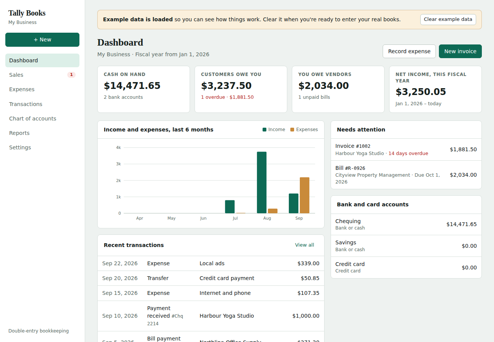

# Tally Books

Double-entry bookkeeping for small businesses. Send invoices, enter bills and expenses, keep a chart of accounts, and run the reports an accountant needs at year-end.

It runs two ways from the same code:

- **Web app:** a small server you run on your computer or a server, then open in any browser. Several people can use it at once, and changes show up live for everyone.
- **Desktop app:** an installable app for Windows, macOS and Linux. It keeps your books in a file on your own computer.



## Features

- **Multiple companies:** keep books for any number of clients. A client list shows each company's bank lines waiting for review, overdue invoices, receivables and when it was last reconciled. Switch between companies from the sidebar.
  - Each company is a separate database file, so books never mix, and a backup covers one client.
  - New companies get the right sales tax for their province or territory: 13% HST in Ontario, 14% in Nova Scotia, 15% in New Brunswick, Newfoundland and Labrador, and PEI, combined GST/QST in Quebec, and 5% GST elsewhere. You can also set the rate yourself.
  - You pick the fiscal year-end, and can copy the chart of accounts from another client.
  - Archive former clients to hide them without deleting anything.
- **Sales:** invoices with line items and sales tax, partial and full payments, and a status on every invoice (open, partial, overdue, paid).
- **Expenses:** vendor bills, bill payments, expenses paid by bank or credit card, and deposits.
- **Banking:** transfers between accounts, credit card payments, and a register for each account with a running balance.
- **Bank statement import:** import CSV, OFX, QFX or QBO files downloaded from online banking, including headerless CSVs like TD's and CIBC's. Lines already imported are skipped, so date ranges can overlap.
- **For review:** each imported line gets a suggestion before it's added:
  - a match with an existing transaction;
  - a payment for an open invoice or bill;
  - a category from a bank rule, or the category used last time for that payee.

  You can add lines one at a time or in bulk, exclude duplicates, and undo anything.
- **Bank rules:** "when the description contains ROGERS, suggest Telephone and internet, HST included."
- **Reconciliation:** enter the statement's ending balance and date, then tick transactions until the difference is zero. You can save and come back later, and undo the most recent reconciliation. Registers mark each line C (cleared) or R (reconciled).
- **Sales tax returns:** a worksheet for each filing period (monthly, quarterly or annual, following the fiscal year) with the figures to enter in the return.
  - **Tax codes:** every invoice, bill, expense and deposit line is **HST/GST**, **Zero-rated in Canada**, **Zero-rated export**, **Exempt** or **No tax**. A customer or vendor can have a default code; for example, a US customer set to Zero-rated export fills that code in automatically on their invoices.
  - **GST/HST (CRA):** lines 90 and 91 split sales into taxable sales in Canada and exempt supplies, zero-rated exports and other revenue, with a breakdown under line 91. Lines 101 to 113C and 114/115 follow. Tax collected, input tax credits, adjustments from journal entries, and instalments are calculated from the books, and you can open the transactions behind each figure. Rebates and self-assessed amounts (lines 111, 205 and 405) are typed in.
  - **QST (Revenu Québec):** Quebec companies track GST (5%) and QST (9.975%) in separate accounts and get their own QST worksheet, lines 203 to 213.
  - **Quick Method:** turn it on from the Sales tax page with the date you start, whether the business mostly provides services or buys goods to resell, and the 1% credit. The remittance rate is filled in from CRA's guide (RC4058) and Revenu Québec's rates: GST/HST 3.6% (services) or 1.8% (goods) at 5%, 8.8% or 4.4% in Ontario (13%), 9.4% or 4.7% in Nova Scotia (14%), 10% or 5% at 15%, and QST 6.6% or 3.4%. Any rate can be typed in. The worksheet works out sales including tax (line 101), the tax to remit (103), credits on capital purchases only (106, for accounts marked *Capital asset*) and the 1% credit on the first $30,000 of the fiscal year (107; $31,421 for QST). It shows the tax kept as income and the tax on expenses that isn't claimed. Filing posts an adjustment that moves those to *Sales tax Quick Method gain* and *Sales tax paid on expenses (Quick Method)*, so the tax account matches the return. A warning appears if sales including tax go over $400,000 in 12 months.
  - **Filing:** marking a return as filed saves its figures and can record the payment to the government, or the refund, which clears the tax account. Instalments can be recorded too.
  - **Filed periods:** changing a transaction in a filed period asks for confirmation first, and the worksheet shows when the books no longer match what was filed.
  - The app produces the figures; returns are still submitted on CRA My Business Account or with Revenu Québec.
- **Payroll (Canada, including Quebec):** pay employees and track what's owed to CRA and Revenu Québec.
  - **Employees:** province of employment, pay schedule (weekly, every 2 weeks, twice a month, monthly), salary or hourly rate, TD1 and TP-1015.3 claim amounts, extra tax, RRSP and union dues at source, CPP/QPP, EI and QPIP exemptions, and amounts paid earlier in the year outside Tally Books.
  - **Pay runs** calculate CPP, CPP2, EI and federal and provincial income tax for every province and territory, and QPP, QPP2, QPIP, Quebec EI and Quebec income tax for Quebec, using CRA's *Payroll Deductions Formulas* (T4127, 123rd edition, July 2026). Employer CPP/QPP, EI (1.4×), QPIP and the Quebec Health Services Fund are included. Yearly maximums are tracked from year-to-date amounts.
  - Every amount can be changed before posting. Changed amounts are marked "Edited" on the pay run.
  - Posting a pay run records one journal entry: wages and employer contributions as expenses, source deductions as liabilities to CRA and Revenu Québec, and net pay out of the bank. Payroll accounts (2300, 2310, 2320, 2330, 7110) are added the first time they're needed.
  - **Pay stubs** with this-pay and year-to-date amounts, printed one at a time or all together.
  - **Remittances:** what's owed to each agency per month (or quarter), the due date (the 15th of the following month), the figures for the PD7A voucher and for Revenu Québec, and payments that clear the liability.
  - **Vacation pay:** for each employee, set it aside each pay (posted to *Vacation pay payable*, 2330) and pay it out when they take vacation or leave, add it to every pay, or let a salary continue during vacation. The rate defaults to the provincial minimum for the employee's years of service (for example Ontario 4%, then 6% after 5 years; Quebec 6% after 3 years) and can be set by hand. It's worked out on regular, holiday and other pay, not on bonuses marked as such. Pay stubs show what's owed, and the employee list shows each balance.
  - **Statutory holiday pay:** each province's public holidays are built in. When one falls in an hourly employee's pay period, the pay run suggests holiday pay at 1/20 of what they earned in the 4 weeks before the holiday's week (the Ontario and Quebec rule; Ontario adds vacation pay paid). Salaried pay already covers holidays. Every amount can be changed.
  - **Records of employment (ROE):** mark an employee's final pay (it pays out the vacation pay owed), then open **Record of employment** on their page. Tally Books fills in every block: pay period type, dates, insurable hours (15A), insurable earnings for each of the last 27 pay periods (15C, for every 2 weeks), the reason code, vacation pay on leaving (17A), statutory holiday pay and other money. It shows the due date (5 days after the final pay period) and prints a worksheet to enter in Service Canada's ROE Web. Saving it keeps the ROE and its serial number with the employee.
  - **Year-end (T4 and RL-1):** a T4 for every employee (one per province they worked in), an RL-1 for Quebec employees, the T4 Summary and the RL-1 Summary, built from the year's pay runs, amounts paid earlier outside Tally Books, and recorded remittances. It covers boxes 14 to 56 (including CPP2/QPP2 in 16A/17A, RPP box 20 with registration number 50 and pension adjustment 52, exemptions in 28, and dental benefits in 45) and RL-1 boxes A to I. Yearly maximums for insurable and pensionable earnings are shared across an employee's slips in date order. The Health Services Fund rate is set from total payroll (all provinces, plus associated employers) and applied to Quebec payroll, and the labour standards contribution is worked out too. Checks flag a missing or invalid SIN, a missing dental code or pension adjustment, and deductions that don't match what CRA's year-end review expects. Export the figures to CSV or print worksheets.
  - Tally Books prepares the figures; you file them with CRA's T4 Web Forms and Revenu Québec's My Account for businesses. Revenu Québec accepts printed RL-1 slips only from certified software, so the printouts are worksheets, not slips.
  - Rates are loaded for pay dates from July 1 to December 31, 2026. Quebec income tax follows Revenu Québec's TP-1015.F method but hasn't been checked line by line against WebRAS yet, so compare a first pay run with WebRAS. Always check unusual cases against CRA's PDOC.
- **AI suggestions (optional, suggestions only):** with a Claude API key, AI suggests a category, payee and sales tax for bank lines that rules and past choices don't cover, and reads a receipt or supplier invoice (photo or PDF) into a draft expense or bill. Nothing is added to the books until someone reviews it and clicks Add or Save. It's switched on per company; an owner sets the key, the model (Claude Haiku 4.5 or Sonnet 5.5) and a monthly spending limit in Settings. The key stays on the server and is never sent to the browser; it can also be set with the `ANTHROPIC_API_KEY` environment variable. What's sent to Anthropic: each bank line's date, description and amount (or the receipt), the company's chart of accounts and payee names. Typical cost is well under a cent per bank line and about a cent per receipt.
- **Receipts from a phone:** clients (or you) open Tally Books on a phone, tap **Take a photo of a receipt**, and it goes to that company's Receipts inbox. Photos are made smaller before they're sent. If AI suggestions are on, each receipt is read in the background (up to 100 a day per company) and matched to a transaction already in the books, a bank line waiting for review, or an unpaid bill. The bookkeeper approves each one: attach it, or record it as an expense or bill (matching the bank line in the same step). The photo stays with the transaction as proof (**View receipt**). Clients can add a note or remove a receipt until it's been recorded; after that it's kept. Add Tally Books to the phone's home screen and it opens like an app. Photos are kept in each company's database; automatic backups copy each one once into a `Receipts` folder beside the dated backups (and off-site), since the daily backup files don't include them.
- **Bring a client over from QuickBooks Online or Sage:** a wizard (Companies → *Bring over from QuickBooks or Sage*, or Settings) reads the reports exported from QuickBooks Online, Sage 50 or Sage Accounting (Excel .xlsx, CSV, or a .zip of them): the chart of accounts, customer and vendor lists, the trial balance, open invoices and unpaid bills, and optionally the Journal report for this year's transactions. It recognises each report, works out each account's type (bank, credit card, A/R, A/P, sales tax…) for you to check, keeps the client's account numbers, and checks that the trial balance balances, that open invoices and bills agree with A/R and A/P, and that the history starts after the trial balance date. Opening balances come in as one journal entry; open invoices and bills come in as items you can receive and make payments against; everything is imported in one go or not at all, with a copy of the books kept on the server first.
- **Company code:** each company can have a 4-digit code (asked for when you create it, and changed or removed by an owner in Settings). Owners and staff type it every time they open that company, so nobody works in the wrong client's books. Clients never need it. Five wrong codes lock that person out of the company for 15 minutes, and an owner who forgets a code can set a new one.
- **Close the books:** after a year-end or a filed return, an owner sets a closing date (with an optional closing password). Transactions, invoices, bills and pay runs on or before it can't be added, changed or deleted unless an owner or staff member unlocks the books for 15 minutes; clients never can. Reconciling and attaching receipts still work. Every closing change and unlock is in the activity log.
- **Export for CaseWare:** Reports → Trial balance → *Export for CaseWare* gives a file for CaseWare Working Papers' Excel/ASCII import: account number, description, CaseWare map number (set on each account), type, and the year-end balance for the current and prior year (debits positive). Earnings of earlier years get their own retained earnings line.
- **Credit notes and vendor credits:** for returns, refunds and corrections. A credit note reverses the income and the sales tax; it can be used on the customer's open invoices (it reduces what they owe without any money moving), or refunded. Vendor credits work the same way against bills. Credits show in Sales and Expenses, the aging reports and the GST/HST and QST worksheets.
- **Invoices, statements and reminders as PDFs, and by email:** invoices and credit notes are laid out with the company's logo, address, contact details and tax number, and a note at the bottom (for payment instructions), in the language the books are kept in. Download them, or email them from the company's own mailbox (Gmail, Yahoo, iCloud, Zoho, Microsoft 365, or a web host's email, set up in Settings → Email with an app password). From Sales: customer statements (open invoices, unused credits and aging, as of any date) for every customer at once, and friendly reminders for overdue invoices. Each document keeps a record of when it was emailed and to whom.
- **English and French:** every screen, form, message, report and pay stub is available in Canadian French, with Quebec terms (TPS/TVQ, RRQ, RQAP, AE, état des résultats, grand livre…) and French number and date formats (1 234,56 $ · 18 sept. 2026). Each person picks their language from the sidebar, the sign-in screen or Account, and it's saved with their account. New companies can keep their books in French, with a French chart of accounts. Names and other data you type stay exactly as entered.
- **Sign-in security:** nobody sees any data without signing in.
  - The first start asks you to create an **owner** account. On an online server this also needs the setup code chosen when the server was installed.
  - **Roles:** owners manage everything; **staff** work in the companies they're given; **clients** see only their own company. Staff and clients can be **view only**.
  - **Invitations:** new people get a one-time link (valid 7 days) to choose their own password. Owners can send a **password reset link** (valid 24 hours). Links are stored only as hashes.
  - **Two-step sign-in:** a 6-digit code from an authenticator app (Microsoft Authenticator, Google Authenticator, 1Password), set up by scanning a QR code, with ten one-time recovery codes. Owners can require it for owners or everyone; online servers require it for everyone.
  - Passwords are stored only as scrypt hashes, never as the password itself.
  - Five wrong passwords or codes from one network address lock that account there for 15 minutes (50 from all addresses lock it everywhere). 20 failures from one address, or more than 3 sign-ins at once, block that address for 15 minutes.
  - The app **locks itself after inactivity** (30 minutes unless you change it), and every sign-in ends after 12 hours.
  - Sessions use HttpOnly, SameSite=Strict cookies (Secure over HTTPS). Pages are served with a strict Content Security Policy and, over HTTPS, HSTS.
  - **Sign-in activity:** every sign-in, failed attempt and account change is logged for owners.
- **Activity log:** every change to a company's books is recorded with who made it, when, and the record before and after. Filter by person or kind of record, open any change to see what was different, and export to CSV (Settings → Activity log).
- **Online server:** [deploy/azure](deploy/azure/README.md) puts Tally Books on a small Azure server in Toronto with HTTPS, nightly tested updates, automatic security patches, and off-site backups to Azure Storage in Canada.
- **Automatic backups:** every company is backed up once a day while the app is open. On a server, each day's backup is also copied to Azure Blob Storage. Backups go to OneDrive by default, or any folder you pick, such as Google Drive. Each day gets its own dated folder, and backups older than the keep period (30 days unless you change it) are removed. Each file restores through **Settings → Restore from backup**. Settings and the company list show backup status, with **Back up now**, **Change folder** and **Open backup folder**.
- **Journal entries:** manual entries with debit and credit lines. The server rejects any entry that doesn't balance.
- **Chart of accounts:** set up for a Canadian small business charging HST (13%). The tax name, rate and fiscal year start are all in Settings.
- **Reports:** profit and loss, balance sheet, trial balance, general ledger, A/R aging and A/P aging, for any date range. All of them export to CSV.
- **General ledger:** every posting in the period grouped by account, with opening balance, debits, credits, running balance and account totals. Show all accounts or pick one; click any line to open the transaction. Income and expense accounts open with their fiscal-year-to-date balance.
- **Year-end:** the trial balance closes prior years into retained earnings, so the CSV is ready to import into working-paper software such as CaseWare.
- **Backup and restore:** one JSON file holds everything. Use it to move books between computers.
- **Example data:** sample customers, transactions and bank lines for trying things out. They're marked "Example" and can be removed in one click.

## Run it as a web app

You need **[Node.js](https://nodejs.org) 22.13 or newer**. The web server has no other dependencies.

```bash
git clone https://github.com/<you>/tally-books.git
cd tally-books
npm start            # or: npm run start:demo  (loads example data on first run)
```

Then open <http://localhost:3000>.

**Shortcut:** instead of typing the command, double-click **Start Tally Books.bat** on Windows or **Start Tally Books.command** on a Mac. It starts the server and opens the app in your browser. Keep the window it opens running while you work, and close it to stop.

Your books are saved in the `data` folder:
- `companies.json` lists your companies;
- `companies/<id>.db` holds each company's books.

These are normal SQLite files, so you can back up the whole folder while the server is stopped, or use **Settings → Download backup** for one company at any time.

If you're upgrading from the single-company version, your existing `data/tally-books.db` becomes your first company automatically.

### Settings

| Environment variable | Default | What it does |
|---|---|---|
| `PORT` | `3000` | Port to listen on |
| `HOST` | `127.0.0.1` | Set to `0.0.0.0` to allow other computers on your network |
| `DATA_DIR` | `./data` | Folder that holds the company list and each company's database |
| `APP_PASSWORD` | *(none)* | An extra shared password the browser asks for before the Tally Books sign-in screen. User accounts protect the data either way; this adds a second layer when the app is on a network. |
| `REQUIRE_2FA` | *(none)* | `owners` or `everyone`: the least two-step sign-in allowed. Online servers use `everyone`. |
| `SETUP_CODE` | *(none)* | If set, creating the first owner account needs this code, so a stranger can't claim a new server. |
| `TRUST_PROXY` | *(off)* | `1` when running behind an HTTPS proxy such as Caddy, so sign-in limits use the visitor's real address. |
| `BACKUP_FOLDER` | OneDrive, if found | Folder for the daily backups. |
| `ANTHROPIC_API_KEY` | *(none)* | A Claude API key for AI suggestions. Without it, an owner can enter one in Settings. |
| `BACKUP_BLOB_URL` | *(none)* | An Azure Blob Storage container URL with a SAS token. Each day's backup is also copied there. A write-only token (Create, Write) is safest, with an Azure lifecycle rule removing old days. If the token can also list and delete, Tally Books removes old days itself. |

To put it on the internet for clients, follow [deploy/azure/README.md](deploy/azure/README.md) rather than opening a port: it adds HTTPS, two-step sign-in and off-site backups.

For example, to share it on your office network:

```bash
HOST=0.0.0.0 APP_PASSWORD='choose-a-long-password' npm start
```

To put it on the internet, run it behind a reverse proxy that handles HTTPS, such as Caddy or nginx. Basic auth sends the password with every request, so don't expose it over plain HTTP.

### Several offices

Run **one** Tally Books server and have every office sign in to it in a browser: for example the server in Toronto, with Ottawa connecting over HTTPS (or over the offices' VPN). Don't run a second server on a copy of the same books, because the two copies would drift apart. One server comfortably handles a few dozen people working at the same time; everyone sees each other's changes live.

People can work in a browser, or in the desktop app: the first time it starts, choose **On our office server** and enter the server's address (it has to start with `https://`). The app then keeps no books on that computer; it opens the office server in its own window, and each person signs in with their own account. **On this computer** keeps the books privately on that one computer instead. Change it any time from **File → Where the books are**. People who used the desktop app before keep their books on their computer without being asked.

## Run it as a desktop app

```bash
npm install          # downloads Electron and the installer builder
npm run desktop      # opens the app in a window
```

To build an installer for the computer you're on:

```bash
npm run dist         # output goes to dist/
```

The desktop app keeps its books in your user data folder. **File → Show data folder** in the app opens it.

### Automatic installers from GitHub

`.github/workflows/release.yml` builds the Windows `.exe`, the macOS `.dmg` and the Linux `.AppImage` on GitHub's computers. To run it, go to **Actions → Build desktop apps → Run workflow**. It also runs when you push a version tag such as `v1.0.0`. When the run finishes, download the installers from the **Artifacts** section at the bottom of the run's page.

### Signing the Windows installer (Azure Artifact Signing)

Without a signature, Windows warns "Windows protected your PC", and Smart App Control blocks the installer completely. Signing fixes both.

1. Set up [Azure Artifact Signing](https://learn.microsoft.com/en-us/azure/trusted-signing/quickstart):
   - a signing account;
   - an approved identity validation;
   - a Public Trust certificate profile;
   - an app registration with the **Artifact Signing Certificate Profile Signer** role on the signing account.
2. In the GitHub repo, go to **Settings → Secrets and variables → Actions**.
   - **Secrets** tab, which stores values privately:
     - `AZURE_TENANT_ID`: the Directory (tenant) ID, from Microsoft Entra ID.
     - `AZURE_CLIENT_ID`: the Application (client) ID, from the app registration.
     - `AZURE_CLIENT_SECRET`: the client secret **Value**.
   - **Variables** tab:
     - `AZURE_SIGNING_ACCOUNT`: the Artifact Signing account name. This isn't the app registration's name.
     - `AZURE_CERT_PROFILE`: the certificate profile name.
     - `AZURE_SIGNING_ENDPOINT`: the endpoint for your account's region, for example `https://eus.codesigning.azure.net`.
     - `AZURE_PUBLISHER_NAME`: the name exactly as it appears on the certificate.
3. Run the workflow again. The log says "Signing the Windows installer as …", and a check step confirms the signature is valid.

The Mac and Linux builds stay unsigned. Signing the Mac version needs Apple's separate Developer Program.

## How it works

```
public/            Browser app (plain HTML, CSS and JavaScript, no build step)
  bankparse.js     Bank file parsers (CSV column detection, OFX/QFX/QBO)
  banking.js       Banking screens: import, review, rules, reconcile
  ai.js            AI suggestions for bank lines, reading receipts, AI settings
  receipts.js      Receipts inbox: sending from a phone, matching, attaching
  pdf.js           A small PDF writer (Helvetica, French accents, JPEG logos)
  docout.js        Invoice, credit note and statement PDFs; email; statements and reminders
  convert-parse.js Reading QuickBooks and Sage exports (CSV, .xlsx, .zip) into an import plan
  convert.js       The Bring over from QuickBooks or Sage wizard
  companies.js     Client list, company switcher, new company
  salestax.js      GST/HST and QST return worksheets, filing, payments
  payroll-calc.js  Payroll deductions (CPP/QPP, EI/QPIP, income tax) from CRA's T4127 formulas, year-end slip figures, public holidays, vacation pay rates and ROE figures
  payroll.js       Employees, pay runs, pay stubs, remittances
  payroll-yearend.js  T4 and RL-1 slips and summaries
  payroll-roe.js   Records of employment (ROE)
  activity.js      Activity log screen
  auth.js          Sign-in, two-step codes, invitations, users and security
  qr.js            QR code generator for the two-step setup screen
  i18n.js          Language switch and on-screen translation; fr-CA number and date formats
  fr.js            French (Canada) translations
src/server/
  app.js           HTTP server: JSON API, static files, live updates
  db.js            SQLite storage (Node's built-in node:sqlite)
  companies.js     Company list; one database file per company
  backups.js       Daily automatic backups to a folder of your choice
  ai.js            AI suggestions through the Claude API (key, spending limit, prompts)
  mail.js          Sending email over SMTP from each company's own mailbox
  auth.js          User accounts, password hashing, sessions, lockout, roles
  validate.js      Bookkeeping rules enforced on every write
  seed.js          Default chart of accounts and example data
  index.js         Command-line entry point
electron/main.js   Desktop wrapper: starts the server privately and opens a window
deploy/azure/      Setup script and guide for an online server on Azure
test/              API tests (node --test)
```

Every transaction is saved as a journal entry, with debit and credit lines that must balance to the cent. Invoices and bills are documents, and each one also posts its own journal entry. The server checks:

- that debits equal credits and each line is one-sided;
- that every line uses an account that exists;
- that payments apply to an existing invoice or bill;
- that you can't delete an account, contact or invoice that other records still use.

Changes that touch several records at once, like saving an invoice together with its journal entry, run in one database transaction.

For your own SQL queries, the database also has a `journal_lines` view with one row per debit or credit line:

```sql
SELECT account_id, SUM(debit) - SUM(credit) AS balance
FROM journal_lines
WHERE date <= '2026-12-31'
GROUP BY account_id;
```

### API

Every route except `/api/health` and `/api/auth/*` requires a signed-in session. Without one it answers `401`, and a user with a temporary password gets `403` until they choose their own.

**Sign-in:** `GET /api/auth/me`, `POST /api/auth/setup` (first owner, only once), `POST /api/auth/login`, `POST /api/auth/logout` and `POST /api/auth/password`. Owners only: `GET`/`POST /api/users`, `PUT /api/users/:id` and `PUT /api/security` (`{ "idleMinutes" }`).

**Across companies:**

| Method | Path | Purpose |
|---|---|---|
| `GET` | `/api/companies` | Every company with a summary, plus the province tax presets |
| `POST` | `/api/companies` | `{ "name", "province", "fyStart", "copyFrom", "examples" }` creates a company |
| `PUT` | `/api/companies/:id` | `{ "archived": true \| false }` |
| `GET` | `/api/backups` | Backup settings and status |
| `PUT` | `/api/backups` | `{ "enabled", "folder", "keepDays" }` |
| `POST` | `/api/backups/run` | Back up every company now |
| `GET` | `/api/events` | Server-sent events: `{ company, rev }` when a company's books change, `{ companies: true }` when the list changes |

**Inside one company:** every path below is under `/api/c/:companyId`.

| Method | Path | Purpose |
|---|---|---|
| `GET` | `/state` | Every account, contact, document, entry, bank line, rule, reconciliation and setting |
| `PUT` | `/records/:collection/:id` | Create or replace a record (`accounts`, `contacts`, `docs`, `entries`, `bankTxns`, `rules`, `recons`, `filings`) |
| `DELETE` | `/records/:collection/:id` | Delete a record |
| `POST` | `/batch` | `{ "writes": [{ "op": "set" \| "delete", "collection", "id", "data" }] }`, applied all or nothing |
| `PUT` | `/settings` | Company settings |
| `POST` | `/bank/import` | `{ "account", "rows": [{ "date", "amount", "desc", "fitid" }] }` adds statement lines to For review, skipping ones already imported |
| `GET` | `/backup` | Download a full backup of this company |
| `POST` | `/restore` | Replace this company's books with a backup |
| `POST` | `/examples` | Load example data |

## Online demo

**Live demo:** https://shersahray.github.io/tally-books/ (GitHub Pages, served from the `gh-pages` branch, which `.github/workflows/pages.yml` updates automatically)


`node scripts/build-demo.js` builds `dist/demo.html`, the whole app in one file. It runs in the browser with two example companies and needs no server. Changes aren't saved and downloads are turned off, so it's only for showing people how the app works.

## Development

```bash
npm test
```

The tests start a real server against a temporary database. They cover the bookkeeping rules, bank file parsing for several Canadian bank formats, statement import and duplicate detection, all-or-nothing batch writes, backup and restore, payroll deductions checked against CRA's published tables and worked examples, cross-site request blocking, password protection, keeping companies separate, and moving books over from the single-company version.

## Not built yet

Live bank feeds (statement import is covered above), sending returns straight to CRA or Revenu Québec, filing T4 and RL-1 slips and records of employment electronically (XML), multiple currencies, and emailing invitations directly (for now you send the link yourself).

## License

MIT
